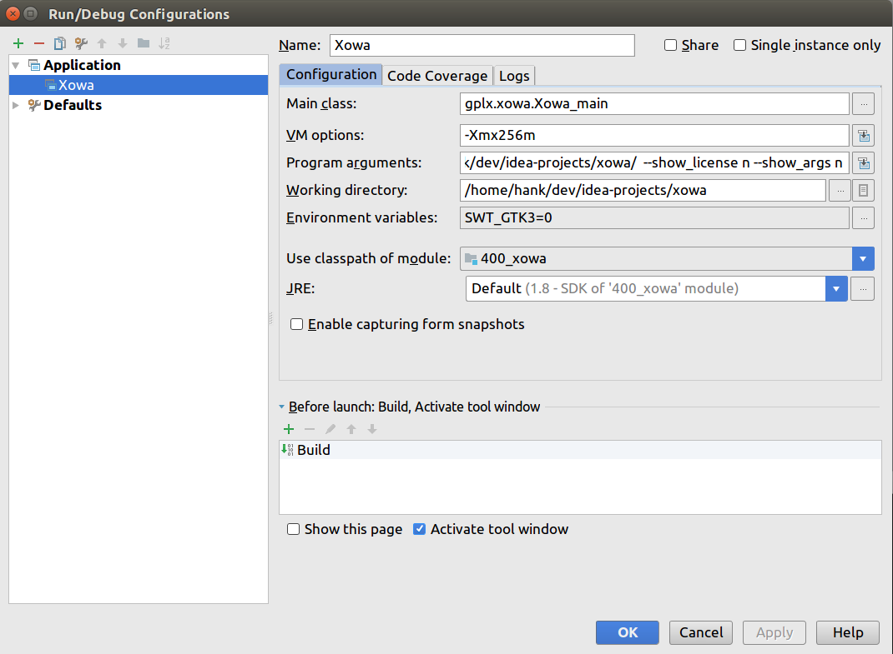

## Overview
We add tools for task generation and user behavior logging into XOWA.

XOWA is an offline Wikipedia application that lets you run Wikipedia on your computer.


## Features
* Run a complete copy of English Wikipedia from your computer.
* Display 5.0+ million articles in full HTML formatting.
* Show images within an article. Access 4.0+ million images using the offline image databases.
* Set up over 800+ other wikis including: English Wiktionary, English Wikisource, English Wikiquote, English Wikivoyage, Non-English wikis (French Wiktionary, German Wikisource, Dutch Wikivoyage), Wikidata, Wikimedia Commons and many more.
* Update your wiki whenever you want, using Wikimedia's database backups.
* Navigate between offline wikis. Click on "Look up this word in Wiktionary" and instantly view the page in Wiktionary.
* Edit articles to remove vandalism or errors.    
* Install to a flash memory card for portability to other machines.
* Run on Windows, Linux and Mac OS X. (Android Alpha available)
* Run as an HTTP server to browse from Firefox, Chrome or Safari
* View the HTML source for any wiki page.
* Search for any page by title using a Wikipedia-like Search box. Search across wikis as well.
* Browse pages by alphabetical order using Special:AllPages.
* Find a word on a page.
* Access a history of viewed pages.
* Bookmark your favorite pages.
* Preview articles by hovering over links
* Customize any one of over 50 options

## Requirements
XOWA is written in Java and requires 1.7 or above.

## Installation
此文档中plat_name是：linux_64 / macosx_64 / windows_64，选择自己对应的平台名称。

### 下载源码
从[https://github.com/we-take-it-easy/xowa](https://github.com/we-take-it-easy/xowa) fork一个repo到自己的github账号 (如Ielool) 下，然后将自己fork出来的repo  clone到自己本地的一个目录下 (例如`/home/hank/git`) 并增加一个remote到`we-take-it-easy/xowa`：
```bash
$ cd /home/hank/git/
$ git clone git@github.com:Ielool/xowa.git
$ cd xowa
$ git remote add we git@github.com:we-take-it-easy/xowa.git
$ git pull we master
$ git push origin master
```

解压其中的`eclipse.tar.gz`
```bash
$ tar -zxvf eclipse.tar.gz
```
将加压出来的目录中的`dev`、`bin`和`user`目录拷贝到xowa目录下，和现有的`dev`以及`bin`目录merge. 然后将解压出来的目录删除。

找到`/home/hank/git/xowa/dev/150_gfui/.classpath`和`/home/hank/git/xowa/dev/400_xowa/.classpath`这两个文件，注意这是两个隐藏文件，将其中的`swt_[plat_name].jar`改成和自己平台对应的。


### 编译
此时：
```bash
$ cd /home/hank/git/xowa/dev
$ ant -buildfile build_[plat_name].xml
``` 
编译完之后，`/xowa/xowa_[plat_name].jar`这个文件会被覆盖，通过`ls -l`命令可以看到该文件的修改时间戳为刚刚编译结束的时间点。

下面建eclipse工程和建IntelliJ工程二选一即可。

### 建eclipse工程
然后我们来创建eclipse工程。打开eclipse，选择new -> java project，取消use default location，然后将project的location选择到`/home/hank/git/xowa/dev/100_core`，然后finish就可以。之后以此类推，按照build.xml中targer从上到下的顺序把110、140、150、gfluence和400_xowa的工程依次建出来。

刷新各个工程确保没有报错，右击400_xowa的工程，选择run as -> run configurations，新建一个java application的run configuration，main class选择`gplx.xowa.Xowa_main`，在arguments里面添加program arguments: 
```
--root_dir /home/hank/git/xowa/ --show_license n --show_args n
```
添加VM arguments:
```
-Xmx256m
```
并选择working directory为other，从file system中选择`/home/hank/git/xowa/`。
在environment里面添加一个环境变量`SWT_GTK3`，value为0

然后把我们之前老版本中的wiki目录拷到`/home/hank/git/xowa/`下，如果太大，创建一个链接（快捷方式）也可以，试了下貌似没问题，但是看xowa的release node里面貌似说链接有可能有bug。

### 建IntelliJ工程
Intellij比eclipse更加好用，我们已经有了eclipse工程文件（.classpath、.project和.settings），可以直接用Intellij识别eclipse工程，方便地创建IntelliJ工程。

打开IntelliJ，菜单栏File -> New -> Project from Existing Sources -> 选择`/home/hank/git/xowa` (xowa的目录) -> 选择import from external model中的eclipse -> 在next中选择create module files near .classpath files，然后一路next到底，finish.

然后打开菜单栏File -> Project Structure，确保Project标签页下的Project language level为8

然后打开菜单栏Run -> Edit Configurations，点左上角的绿色加号，新建一个Application的run configuration，然后填入如下图所示的内容：


其中Program arguments和Working directory的值和eclipse中的一样。点击OK.

然后就可以在菜单栏Run中选择Run 'Xowa'了，运行成功说明IntelliJ工程就建成啦。

### 运行
现在不论是从命令行里运行`/home/hank/git/xowa/xowa_[plat_name].sh`还是在从IDE中都可以正常运行了。

## License
XOWA is licensed under the terms of the General Public License (GPL) Version 3,
or alternatively under the terms of the Apache License Version 2.0.

See LICENSE.txt for more information.
